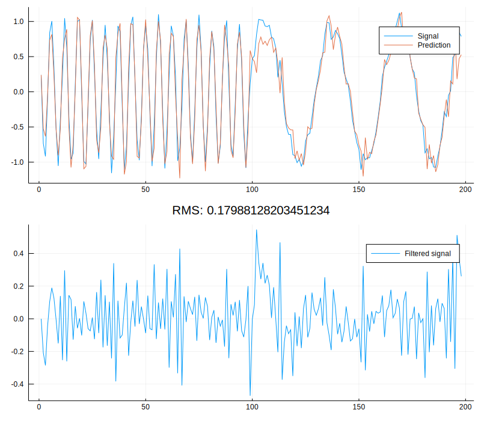

# AdaptiveFilters

[](https://travis-ci.org/baggepinnen/AdaptiveFilters.jl)
[](https://codecov.io/gh/baggepinnen/AdaptiveFilters.jl)


Simple adaptive AR filters. We export a single function:

```julia
yh = adaptive_filter(y, alg=OMAP; order=6, lr=0.25)
```
This filters `y` with an adaptive AR (only poles) filter with specified order and returns `yh` which is the predicted output from an adaptive line enhancer (ALE). If your noise is wideband and signal narrowband, `yh` is your desired filtered signal. If the noise is narrowband and the signal is wideband, then `y-yh` is your desired filtered signal.

Arguments:
- `alg`: Stochastic approximation algorithm or weight function. Examples: `OMAP, MSPI, OMAS, ADAM, ExponentialWeight, EqualWeight`. `ExponentialWeight` corresponds to the recursive least-squares algorithm (RLS). `ADAM` corresponds *roughly* to the normalized least-mean squares (NLMS) algorithm. More options exist if OnlineStats is loaded.
- `y`: Input signal
- `order`: Filter order
- `lr`: Learning rate or weight depending on `alg`

## Installation
```julia
using Pkg; Pkg.add(PackageSpec(url="https://github.com/baggepinnen/AdaptiveFilters.jl"))
```


## Demo app
```julia
using AdaptiveFilters, Plots, Interact
inspectdr() # Preferred plotting backend for waveforms

y = [sin.(1:100) .+ 0.1.*randn(100);
         sin.(0.2 .*(1:100)) .+ 0.1.*randn(100)]

function app(req=nothing)
    @manipulate for order = 2:2:10,
                    lr = LinRange(0.1, 0.9, 40),
                    alg = [ExponentialWeight, MSPI, OMAP, OMAS, ADAM]
        yh = adaptive_filter(y, alg, order=order, lr=lr)
        e = y.-yh
        plot([y yh], lab=["Measured signal" "Prediction"], layout=(2,1), show=false, sp=1)
        plot!(e, lab="Error", sp=2, title="RMS: $(√mean(abs2, e))")
    end
end

app()

# Save filtered sound to disk
using WAV
yh = adaptive_filter(y, 4, 0.25, OMAP)
e = y.-yh
wavwrite(e, "filtered.wav"), Fs=fs)
```



## Internals
This is a lightweight wrapper around functionality in [OnlineStats.jl](https://github.com/joshday/OnlineStats.jl) which does all the heavy lifting.

## Usage from python
1. First install Julia and install this package in Julia.
2. Install [pyjulia](https://github.com/JuliaPy/pyjulia) using their instructions.
3. Now the following should work

```python
$ python3
>>> import julia
>>> from julia import AdaptiveFilters as af
>>> yh = af.adaptive_filter(y)
```
if that fails, try replacing the first line with
```python
>>> from julia.api import Julia
>>> jl = Julia(compiled_modules=False)
```

Keyword args etc. work as normal
```python
af.adaptive_filter(y, af.ADAM, order=2)
```
